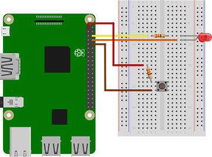
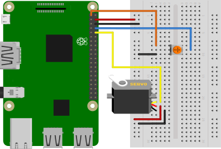
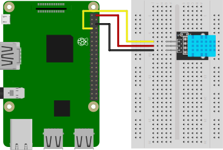
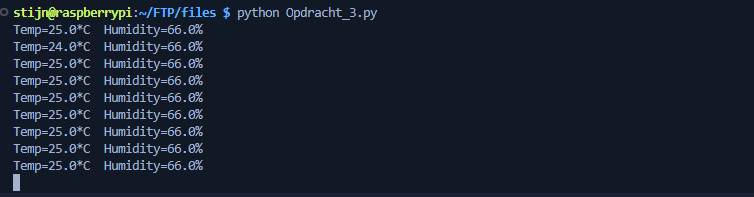

# Raspberry Pi
Om kennismaken met de Raspberry Pi, gaan we een aantal eenvoudige opdrachten uitvoeren die mogelijks relevant zijn aan de masterproef. We gebruiken hiervoor de Raspberry Pi 3B+.

De opdrachten zijn:
1. Aansturen van DO (LED) en inlezen van een DI (drukknop)
2. Aansturen van een AO (servomotor) en inlezen van een AI (potentiometer)
3. Inlezen van een temperatuur- en vochtigheidssensor (DHT11)
4. Oproepen van functies d.m.v. een ingang-interrupt

Tijdens deze opdrachten zullen we gebruik maken van de GPIO-pinnen van de Raspberry Pi. Deze pinnen zijn als volgt genummerd:


### 1. Aansturen van DO (LED) en inlezen van een DI (drukknop)
De componenten zijn als volgt aangesloten:
* LED is aangesloten op GPIO14
* Drukknop is aangesloten op GPIO15


De gebruikte code voor deze opdracht is:
:::code source="static/Opdracht_1.py" :::

### 2. Aansturen van een AO (servomotor) en inlezen van een AI (potentiometer)
De componenten zijn als volgt aangesloten:
* Potentiometer is aangesloten op GPIO14
* Servomotor is aangesloten op GPIO15

Aangezien de gebruikte servomotor slechts een beperkte hoeveelheid stroom trekt, is het toegelaten om deze rechtstreeks te voeden vanuit de Raspberry Pi. Indien er meerdere of krachtigere servomotoren worden aangesloten, is het verplicht om deze aan te sluiten op een externe voeding.



De gebruikte code voor deze opdracht is:
:::code source="static/Opdracht_2.py" :::

### 3. Inlezen van een temperatuur- en vochtigheidssensor (DHT11)


De gebruikte code voor deze opdracht is:
:::code source="static/Opdracht_3.py" :::

De code maakt gebruik van de "Adafruit_DHT" bibliotheek. Deze is te installeren door volgend commando uit te voeren:
```bash
pip install Adafruit-DHT
```

In de terminal kan je de temperatuur en vochtigheid aflezen:


### 4. Oproepen van functies d.m.v. een ingang-interrup
De componenten zijn als volgt aangesloten:
* LED is aangesloten op GPIO14
* Drukknop is aangesloten op GPIO15


De gebruikte code voor deze opdracht is:
:::code source="static/Opdracht_4.py" :::